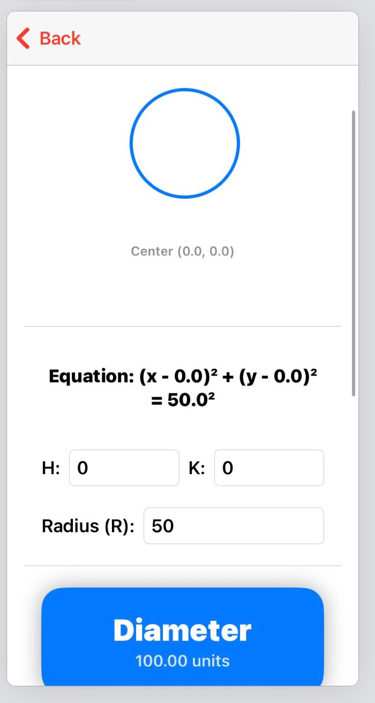
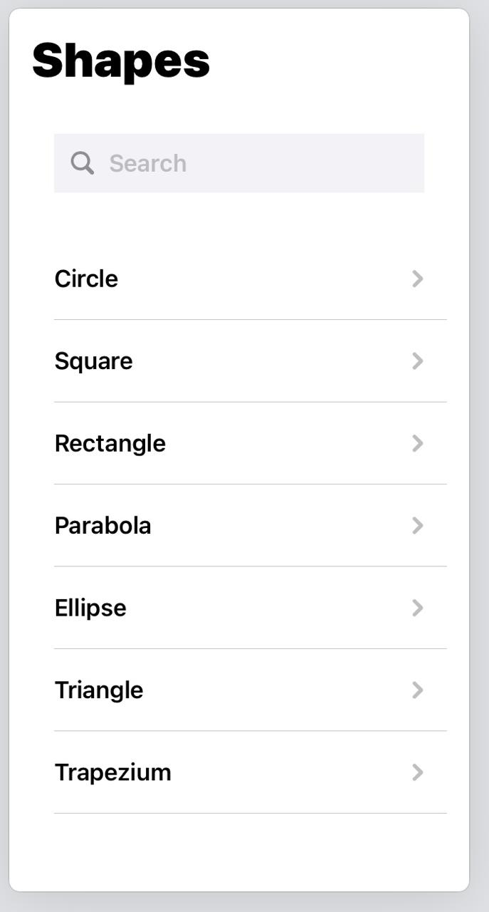
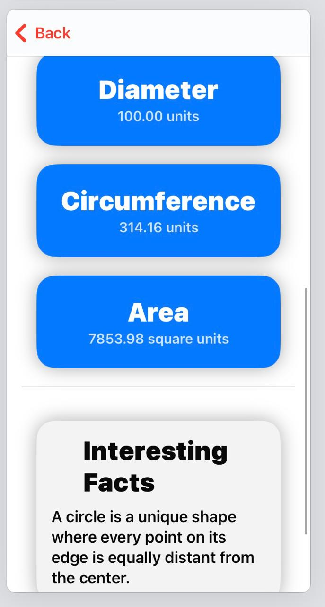

# Geometry Visualizer (SwiftUI - iPad)

An interactive educational app built using **SwiftUI in Swift Playgrounds (iPad)** to explore and visualize geometric shapes. This project helps users understand the formulas, dimensions, and graphical representations of common 2D figures through a clean, tappable interface.

---

## Features

- Visual representation of shapes using SwiftUI `Path` and native views.
- Real-time calculation of:
  - Area
  - Perimeter/Circumference
  - Diameter (for circles)
- Flip cards with formulas and values.
- Glassmorphism effect for "Interesting Facts" section.
- Easy navigation between shapes.

---

## Supported Shapes

- Circle  
- Square  
- Rectangle  
- Parabola  
- Ellipse  
- Triangle  
- Trapezium  

---

## Built With

- SwiftUI  
- Swift Playgrounds (on iPad)  
- Interactive Views (`ZStack`, `Path`, `ScrollView`, `TextField`, `VStack`)  
- Animations (`withAnimation`, `.rotation3DEffect`)  
- State Management with `@State` properties  

---

## Getting Started

1. Open this project in **Swift Playgrounds** (iPad or Mac).  
2. Explore shapes from the main menu.  
3. Tap to flip formula cards.  
4. Modify dimensions (like base, height, radius) and see visuals update instantly.

